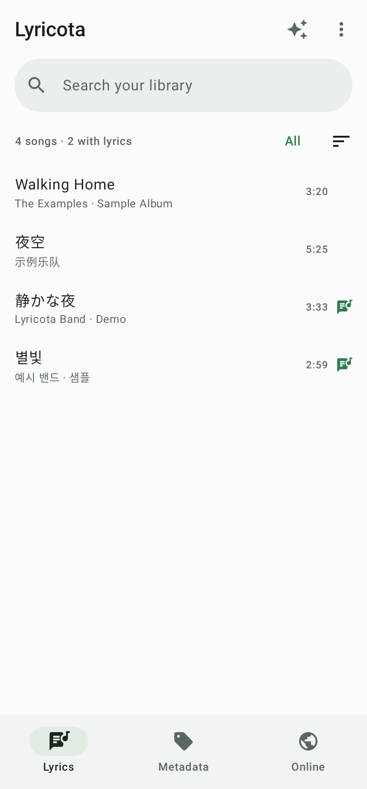
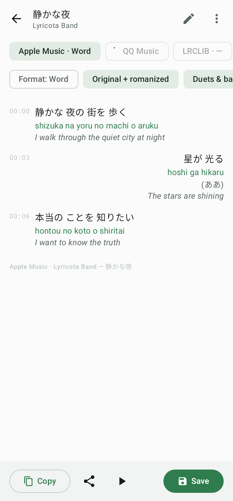
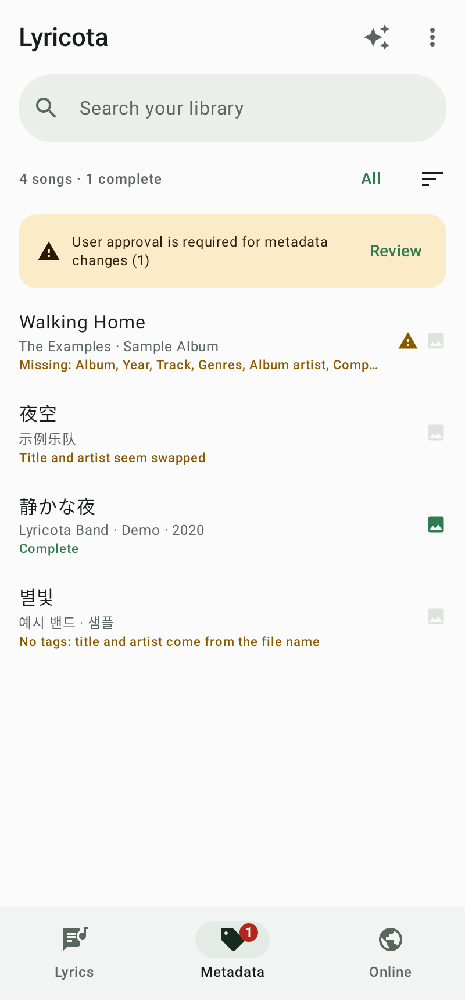
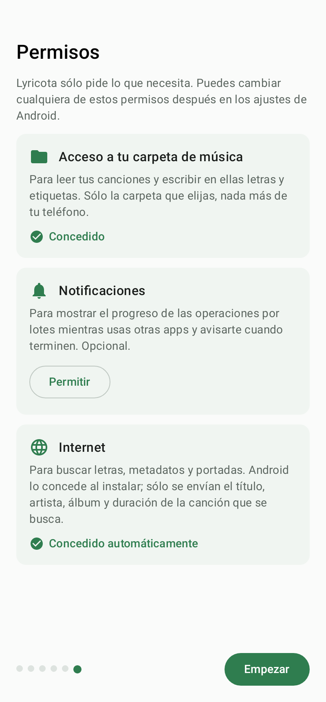

<p align="center">
  
</p>

<h1 align="center">Lyricota</h1>

<p align="center">
  Synced lyrics (word by word when available) and complete metadata for the music on your Android phone.<br>
  <em>Letras sincronizadas (palabra por palabra cuando existen) y metadatos completos para la música de tu teléfono.</em>
</p>

<p align="center">
  <a href="../../releases/latest"></a>
  
  <a href="LICENSE"></a>
</p>

<p align="center">
  <a href="https://ko-fi.com/A0A618Z66T"></a>
</p>

<p align="center">
  
  
  
  
</p>

## Features

- **Lyrics from several sources at once**, picking the best result (word by word first). Saved as an embedded tag or as a `.lrc` file next to the song.
- **Duets and backing vocals**: marks singers (`v2:`) and background vocals (`[bg: …]`) in the Apple Music / AMLL style.
- **Romanization** for Japanese (Kuromoji + custom kana rules), Korean (Revised Romanization with pronunciation rules) and Chinese (pinyin), aligned to karaoke timing. Uses the official romanization when the source provides it. Translations when available.
- **Metadata section**: title, album, artist(s), album artist, composers, genres, year, track/total and disc/total, compared across Deezer, Apple Music and MusicBrainz, plus cover image search. One song at a time or in bulk (selected, all, or songs missing metadata). In bulk, changes are applied only when the title and artist match; everything else waits for your approval.
- **Reads the real tags** of each file (MP3, FLAC, M4A, OGG, Opus, WAV, AIFF, APE, WavPack, WMA) and detects songs whose title and artist are swapped.
- **Background batches** with a progress notification (percentage) and a notification when they finish.
- Fast, incremental library scan: only new or changed songs are read again.
- **Lyrics already in the song**: shows the embedded lyrics (or the `.lrc` next to the file) even when no source finds the song, with a switch to compare them with what the sources found.
- Built-in player with **letter-by-letter karaoke** highlighting to check the sync and adjust the offset.
- **Sync by hand**: paste or import lyrics (`.lrc` / `.txt`) and tap as each line starts while the song plays. Also useful to fix a line that is off.
- **Tools**: convert between embedded lyrics and `.lrc` files in bulk, rename files from their tags, find duplicates, and **undo the last batch**.
- **Share with Lyricota** (or *Open with*) from any music player or file manager to jump straight to that song's lyrics.
- First-run tutorial that explains each permission before asking for it.
- In-app update notice with one-tap download from GitHub Releases.
- Interface in English, Spanish, Portuguese and Japanese.

Example output:

```
[01:23.513]<01:23.513>My <01:23.805>song<01:24.190>
[bg: <01:23.902>My <01:24.095>song<01:24.412>]
[02:54.809]v2:<02:54.809>They <02:55.114>know <02:55.289>it<02:55.528>
```

## Download

Get the latest APK from the [Releases](../../releases/latest) page. Requires Android 8.0 or newer.

**Updates:** the app checks this repository's latest release when it opens (at most twice a day; can be turned off in Settings) and offers to download and install the new version. Your settings and library are kept. You can also track releases with [Obtainium](https://github.com/ImranR98/Obtainium).

## Permissions

| Permission | Why |
|---|---|
| Access to one music folder (chosen by you through Android's folder picker) | Read your songs and write lyrics and tags into them. Nothing else on the device is accessed. |
| Notifications (optional, Android 13+) | Show the progress of batch operations and tell you when they finish. |
| Internet | Search lyrics, metadata and covers. Only the title, artist, album and duration of the song being searched are sent. |
| Foreground service | Keep a batch running while you use other apps. |
| Install apps (asked only when you accept an update) | Open Android's installer with the new version downloaded from GitHub Releases. |

Lyricota has no accounts, ads, analytics or trackers.

## Lyrics sources

| Source | Sync | Notes |
|---|---|---|
| Apple Music | word, duets, backing vocals | via the community service `lyrics.paxsenix.org`; search with the public iTunes Search API |
| [AMLL TTML DB](https://github.com/amll-dev/amll-ttml-db) | word, duets, backing vocals | community database; contributor-written lyrics are CC0-1.0, imported data keeps its original terms |
| QQ Music | word (QRC) | public web endpoints |
| Kugou | word (KRC) | public web endpoints |
| NetEase Cloud Music | word (YRC) | public web endpoints |
| SyncLRC | word / line | public API |
| [LRCLIB](https://lrclib.net) | line | open database |

## Metadata and cover sources

| Source | Provides |
|---|---|
| [Deezer API](https://developers.deezer.com/api) | album, album artist, genres, track/disc numbers, release date, 1000 px covers |
| iTunes Search API | other editions, covers up to 3000 px |
| [MusicBrainz](https://musicbrainz.org) + [Cover Art Archive](https://coverartarchive.org) | composers (from works), genres, releases, covers. Core data CC0; genres/tags CC BY-NC-SA 3.0 |

Tags are written for MP3 (ID3v2.3/2.4), FLAC, M4A, OGG Vorbis and Opus; WAV, AIFF, APE/WavPack and WMA tags are read only.

## Build

Requires JDK 17 and the Android SDK (API 34).

```bash
./gradlew assembleDebug
./gradlew testDebugUnitTest
```

Tests that hit the real services only run with `LIVE=true`.

## Feedback

Found a bug, have an idea or want to say thanks? Use **⋮ → Send feedback** in the app, or [open an issue](../../issues/new/choose). The app never sends anything by itself: it opens GitHub with your message written so you can review and send it.

## Translations

Lyricota is available in English, Spanish, Portuguese and Japanese. Strings live in `app/src/main/res/values*/strings.xml`. Corrections and new languages are welcome as pull requests.

## Support

Lyricota is free and always will be. If it's useful to you, you can buy me a coffee:

<a href="https://ko-fi.com/A0A618Z66T"></a>

## Legal

- **Lyrics are not included in this repository or in the app.** The app downloads them on demand, at the user's request, for personal use. Lyrics are copyrighted by their authors and publishers. Test fixtures and screenshots in this repository contain only invented text.
- Lyricota is an independent project and is **not affiliated with, endorsed or sponsored by** Apple, Tencent (QQ Music), Kugou, NetEase, Deezer, the MetaBrainz Foundation (MusicBrainz, Cover Art Archive), LRCLIB, SyncLRC, paxsenix or AMLL. All trademarks belong to their owners. Use of each service is subject to its own terms of service; you are responsible for complying with them.
- Third-party software and its licenses are listed in [NOTICE.md](NOTICE.md) and in the app under *About*.

## License

Lyricota is free software, licensed under the **GNU General Public License v3.0** — see [LICENSE](LICENSE).

The QQ Music QRC decryption follows the algorithm documented by [QQMusicDecoder](https://github.com/WXRIW/QQMusicDecoder) (MIT) and the GPL-3.0 project [LDDC](https://github.com/chenmozhijin/LDDC), which is why the whole project uses GPL-3.0.
